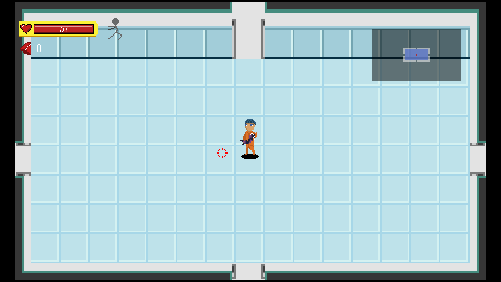
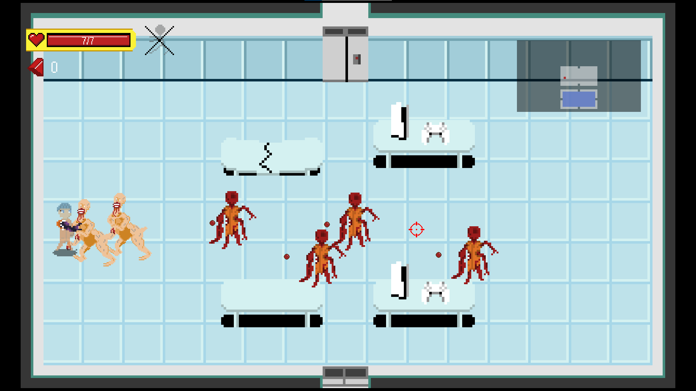
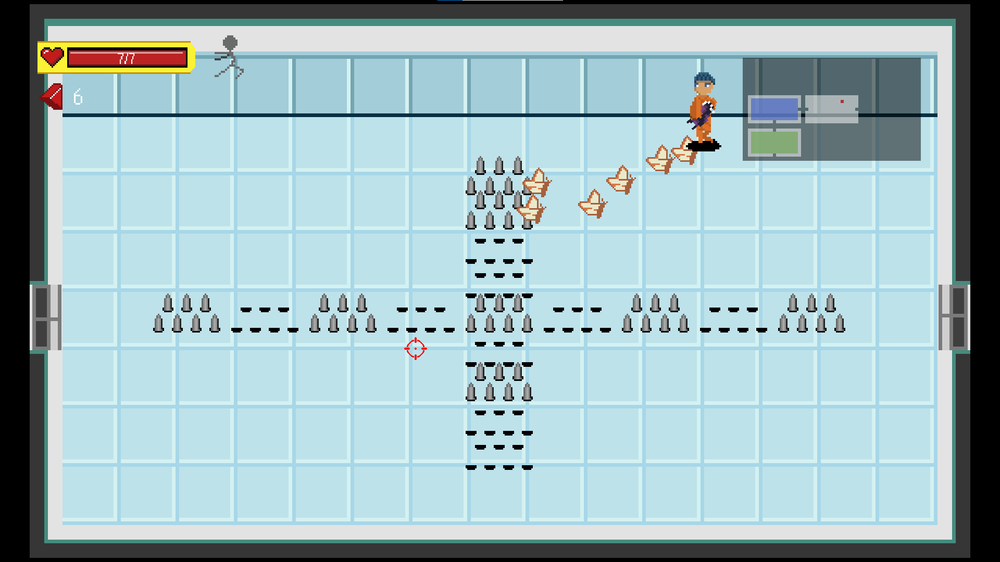
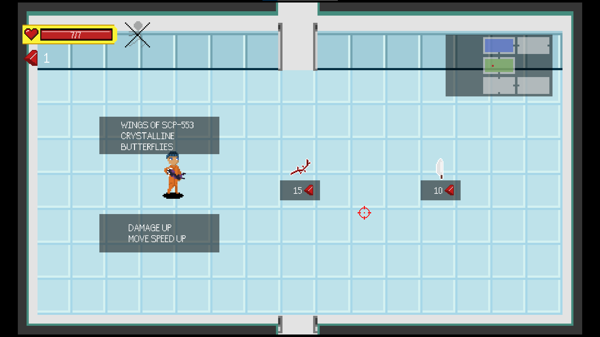
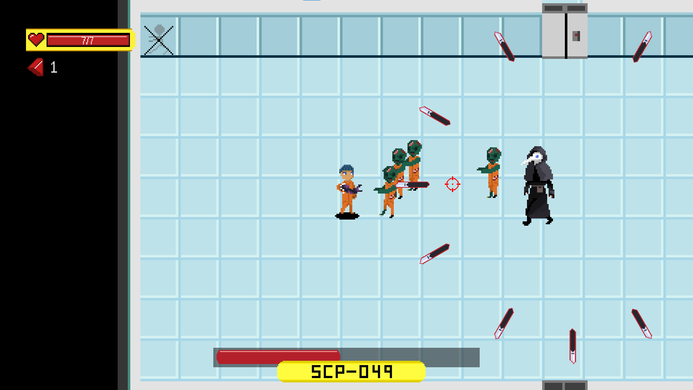
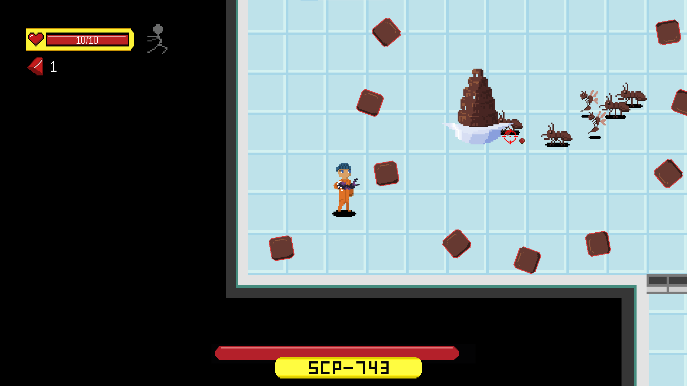

# 2025 OOPL Final Report

## 組別資訊

組別：32
組員：謝博任
復刻遊戲：SCP Roguelike

## 專案簡介

### 遊戲簡介
五年前偶然看到一位叫 Ting 的 YouTuber，他專門做 SCP 的翻譯和解說。那時他上傳了一支介紹自己做的 SCP 遊戲的影片，之後也分享了他參加 Game Jam 的過程。
對當時想做遊戲卻不知道怎麼開始的我來說，這些影片給了我很大的啟發，也讓我之後開始嘗試自己動手做遊戲，所以這次實習我也決定來復刻他的遊戲。
	同時，也把這當作對自己的挑戰，嘗試獨立繪製遊戲中的美術素材，並加入了原本遊戲中沒有出現的SCP。

### 組別分工
本次專案是我自己一個人獨自完成，故沒有分組分配進度的部分。
## 遊戲介紹

### 遊戲規則
本遊戲屬於 **Roguelike 類型**，玩家需要不斷打怪升級，最終逃離 SCP 設施。若血量歸零，遊戲將從頭開始。

每一層包含「小怪區」與「Boss 房」。原作共有四層，為了增加挑戰，我額外新增了第五層作為最終關卡。

#### 小怪層內容

每層房間皆為隨機生成，小怪層固定包含以下房間：

- **怪物房**：  
  進入後門會上鎖，必須擊敗所有敵人才能離開。
  
- **商店**：  
  使用「血塊」（敵人掉落的貨幣）購買道具以升級數值，包括血量、攻擊力、攻速、移動速度等。
  
- **寶箱房**：  
  按下 `E` 鍵打開寶箱，可獲得隨機道具。道具觸碰即可撿起，並會顯示其名稱與效果。

- **通往 Boss 房的電梯**

#### Boss 設計

Boss 房將出現以下其中一種 SCP：

- **SCP-049**：瘟疫醫生  
- **SCP-743**：巧克力噴泉

#### 遊戲控制與功能

- 按下 `Esc` 可開啟選單，功能包括：
  - 音量調整
  - 返回主選單
  - 左側顯示可用的所有按鍵與Debug 快捷鍵
### 遊戲畫面

---

#### 🎮 遊戲主畫面

---

#### 🧍 玩家出生點

---

#### 👾 小怪展示
- 小怪 1  
  

- 小怪 2  
  

---

#### 🛒 商店畫面

---

#### 🧟 Boss 展示
- Boss 1（SCP-049）  
  

- Boss 2（SCP-743）  
  

## 程式設計

### 程式架構

這次實習中，我將主要類別分為以下四大類別：

- **遊戲物件**
- **遊戲介面**
- **遊戲核心**
- **其他功能**

以下為整體架構圖：

---

### 程式技術

這次實作中使用了多種技術，以下列出幾項主要的設計與實作方法：

---

#### 1. 動態物件 Actor 與靜態物件 Solid

- 兩者的主要差異在於是否會移動：
  - **Actor**：擁有移動函式，並會主動偵測碰撞。
  - **Solid**：為靜態物件，只需要被動參與碰撞檢測。
- 這樣的區分可有效減少效能消耗，也方便邏輯管理。
- `Actor` 下包含：
  - `Player`
  - `Enemy`
  - `Bullet` 等

> 所有敵人類別皆繼承 `Enemy` 類，並共用基本屬性（如血量、攻擊力等）。  
> 為了支援近戰與遠程行為，實作了攻擊介面，方便子類進行自定義實作。

---

#### 2. 碰撞箱與碰撞箱管理者（BoxCollider 與 ColliderManager）

- 遊戲中涉及多種物理交互（推擠、阻擋、感應等），為方便管理，設計了統一的碰撞系統。
- 模仿 Unity 實作了 `Trigger` 概念，並為 `BoxCollider` 設計以下虛擬函式：
  - `TriggerEnter`
  - `TriggerStay`
  - `TriggerExit`

> 子類可根據需要實作上述方法以處理各種觸發邏輯。  
> 所有碰撞處理皆統一交由 `ColliderManager` 執行，透過 `HandleCollision` 檢測結果，再觸發對應事件。

---

#### 3. LevelManager 與 Tilemap 系統

- 利用 Tilemap 儲存每一層的基本資訊，如牆壁位置、敵人配置等。
- `LevelManager` 負責呼叫與初始化地圖，並進行隨機關卡生成。
- 小怪層未使用多個相機切換，改用「隱藏/傳送」機制模擬房間切換。
- 除此之外，`LevelManager` 還處理以下功能：
  - 控制每個房間的狀態更新
  - 負責呼叫物件的 `Update()` 函式
  - 回傳地圖資訊供 UI 顯示小地圖

## 結語

### 問題與解決方法

1. **碰撞系統設計初期過於繁瑣**  
   一開始所有物件的碰撞邏輯都各自實作，導致程式碼冗長且難以維護。後來改為統一使用前面提到的 `ColliderManager` 進行集中管理，大幅簡化了碰撞處理的流程。

2. **子彈碰撞檢測造成效能瓶頸**  
   子彈需要對所有物件進行碰撞檢測，導致在物件數量多時容易出現卡頓。為了解決這個問題，我結合 `LevelManager`，僅對當前畫面中顯示的物件進行碰撞處理，有效提升了遊戲效能。

3. **滑鼠位置偵測與螢幕解析度不一致問題**  
   因為不同裝置的解析度不同，我一開始找不到能自動依照解析度縮放畫面的方式。最後決定統一解析度為 `1920x1080`，並採用「無邊框全螢幕」的方式來強制畫面填滿。  
   然而，這樣做會導致滑鼠碰得到畫面邊界，但實際偵測到的位置卻有偏差。最終我實作了一個滑鼠位置校準功能，玩家可按下 `C` 鍵啟動校準，點擊畫面左上角，系統會根據滑鼠實際位置與螢幕左上角的差距來計算縮放比例，成功對齊滑鼠與畫面座標。

4. **渲染與視窗模式的限制**  
   雖然新版的框架支援解析度調整，但似乎無法更改渲染方式，這導致像素風格的圖像容易被模糊處理。  
   此外，仍然無法在遊戲中動態切換全螢幕與視窗模式，這也帶來一定的使用限制。
### 自評

| 項次 | 項目                   | 完成 |
|------|------------------------|-------|
| 1    | 這是範例 |  V  |
| 2    | 完成專案權限改為 public |  V  |
| 3    | 具有 debug mode 的功能  |  V  |
| 4    | 解決專案上所有 Memory Leak 的問題  |  V  |
| 5    | 報告中沒有任何錯字，以及沒有任何一項遺漏  |  V  |
| 6    | 報告至少保持基本的美感，人類可讀  |  V  |

### 心得

我本來就對遊戲創作非常有興趣，也很感謝助教允許我自行繪製美術素材，讓我除了程式開發之外，也能練習繪圖相關技能。這次實作也讓我真正理解了理論課上學到的各種技術與概念，實作過程非常有趣。  
每次回家只要有空我就會繼續開發，因此也順利在期中前完成整個遊戲，讓我獲得滿滿的成就感。

### 貢獻比例

由於本次專案為個人製作，程式、美術、設計全由我一人完成，貢獻比例為 **100%**。
