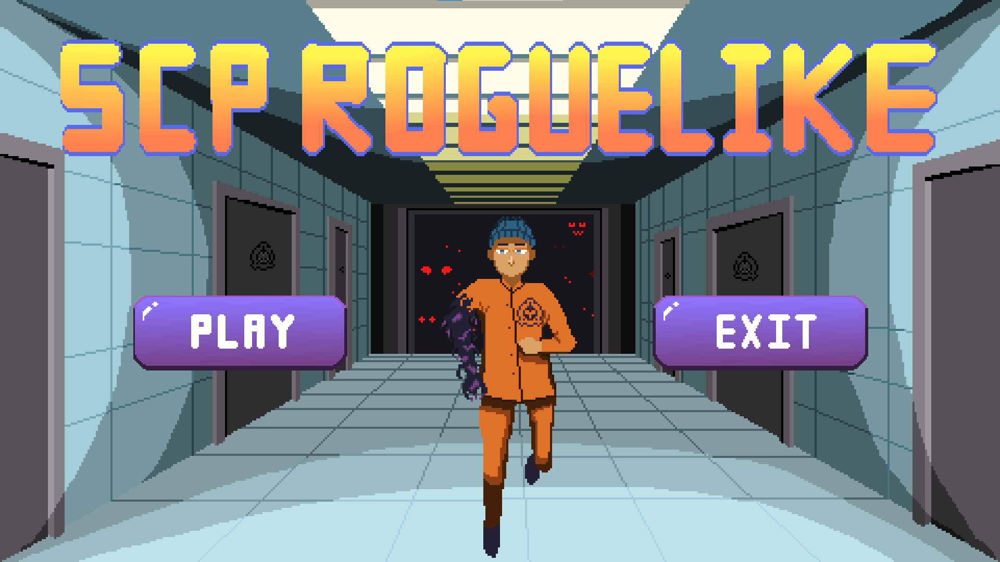

# 2025 OOPL Final Report

## 組別資訊

組別：32
組員：謝博任
復刻遊戲：SCP Roguelike

## 專案簡介

### 遊戲簡介
五年前偶然看到一位叫 Ting 的 YouTuber，他專門做 SCP 的翻譯和解說。那時他上傳了一支介紹自己做的 SCP 遊戲的影片，之後也分享了他參加 Game Jam 的過程。
對當時想做遊戲卻不知道怎麼開始的我來說，這些影片給了我很大的啟發，也讓我之後開始嘗試自己動手做遊戲，所以這次實習我也決定來復刻他的遊戲。
	同時，也把這當作對自己的挑戰，嘗試獨立繪製遊戲中的美術素材，並加入了原本遊戲中沒有出現的SCP。

### 組別分工
本次專案是我自己一個人獨自完成，故沒有分組分配進度的部分。
## 遊戲介紹

### 遊戲規則
本遊戲屬於 **Roguelike 類型**，玩家需要不斷打怪升級，最終逃離 SCP 設施。若血量歸零，遊戲將從頭開始。

每一層包含「小怪區」與「Boss 房」。原作共有四層，為了增加挑戰，我額外新增了第五層作為最終關卡。

#### 小怪層內容

每層房間皆為隨機生成，小怪層固定包含以下房間：

- **怪物房**：  
  進入後門會上鎖，必須擊敗所有敵人才能離開。
  
- **商店**：  
  使用「血塊」（敵人掉落的貨幣）購買道具以升級數值，包括血量、攻擊力、攻速、移動速度等。
  
- **寶箱房**：  
  按下 `E` 鍵打開寶箱，可獲得隨機道具。道具觸碰即可撿起，並會顯示其名稱與效果。

- **通往 Boss 房的電梯**

#### Boss 設計

Boss 房將出現以下其中一種 SCP：

- **SCP-049**：瘟疫醫生  
- **SCP-743**：巧克力噴泉

#### 遊戲控制與功能

- 按下 `Esc` 可開啟選單，功能包括：
  - 音量調整
  - 返回主選單
  - 左側顯示可用的所有按鍵與Debug 快捷鍵
### 遊戲畫面

## 程式設計

### 程式架構
### 程式技術

## 結語

### 問題與解決方法
### 自評

| 項次 | 項目                   | 完成 |
|------|------------------------|-------|
| 1    | 這是範例 |  V  |
| 2    | 完成專案權限改為 public |  V  |
| 3    | 具有 debug mode 的功能  |  V  |
| 4    | 解決專案上所有 Memory Leak 的問題  |  V  |
| 5    | 報告中沒有任何錯字，以及沒有任何一項遺漏  |  V  |
| 6    | 報告至少保持基本的美感，人類可讀  |  V  |

### 心得
### 貢獻比例