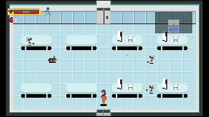
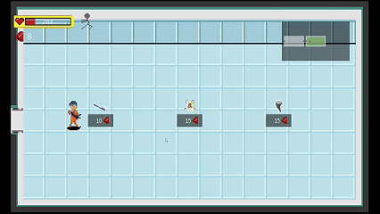
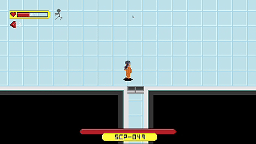
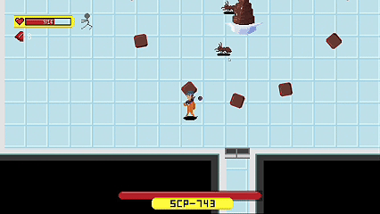

[](README.md) [](README.zh-TW.md)

# SCP Roguelike

<div align="center">
  

  <br>

  
  
  
  

  <p>
    <b>A Roguelike game based on C++ and Object-Oriented Design (OOP).</b><br>
    Solo Development: Program Architecture / Game Logic / Pixel Art
  </p>
</div>

---

## 📖 Introduction
**SCP Roguelike** is a major final project for a C++ OOP course. Players take on the role of a Class-D personnel parasitized by an unknown SCP, using supernatural abilities to escape a randomly shifting containment facility.

This project demonstrates the ability to **build game systems from scratch**. It utilizes the low-level graphics library NTUT-PTSD and features self-implemented core systems, including physics collision, procedural map generation algorithms.

> 🎬 **Watch Full Demo Video (with Sound)**: [YouTube Link](https://youtu.be/PVSwFwm1gOk)

## 🎮 Gameplay Showcase

| ⚔️ Combat | 🛒 Random Shop System |
| :---: | :---: |
|  |  |

### 💀 Boss Battles
Unique **State Machine** behavior logic designed for different SCP characteristics:

| SCP-049 (Plague Doctor) | SCP-743 (Chocolate Fountain) |
| :---: | :---: |
| **Summon & Daggers**: <br>Summons zombies and launches dagger attacks. | **Swarm Attack**: <br>Controls a massive ant swarm for encirclement tactics and uses ants for propulsion. |
|  |  |

---

## 🛠 Technical Deep Dive

This project strictly follows **Object-Oriented Programming (OOP)** principles and **Modern C++ (Smart Pointers)** standards.

### 1. Architecture & Design Patterns
* **Polymorphism & Interfaces:**
    * Established an `Actor` base class to handle common physics and rendering.
    * Defined Boss behaviors via the `IBoss` interface (e.g., `Summon()`) and used `virtual functions` to implement distinct `Update()` and `Attack()` logic for different enemies.
* **Singleton Pattern:**
    * Applied to `ColliderManager` and `LevelManager` to ensure globally unique physics worlds and level state management, facilitating cross-object access.
* **Component-Based Thinking:**
    * Encapsulated Collision (`BoxCollider`), Animation (`Animation`), and Stats (`Health`) into independent modules for code reusability.

### 2. Procedural Map Generation
Core logic located in `LevelManager.cpp`:
* Adopts **Randomized Breadth-First Search (BFS) / Queue-based Generation** algorithms.
* Starts from the origin, utilizing `std::queue` and `std::shuffle` to determine room expansion directions (Up/Down/Left/Right), generating a non-repetitive and fully connected maze structure.
* Automatically identifies "dead ends" and "farthest distance" to intelligently place **Boss Rooms** and **Treasure Rooms**.

### 3. Custom Physics System
* Does not rely on existing physics engines; implemented **AABB (Axis-Aligned Bounding Box)** collision detection from scratch.
* `ColliderManager` unifies all colliders, supporting callbacks like `OnTriggerEnter`, `OnTriggerStay`, and `OnTriggerExit` for precise attack detection and environmental interaction.

### 4. Memory Management
* Fully adopted C++ Smart Pointers (`std::shared_ptr`, `std::weak_ptr`) instead of raw pointers.
* Used `std::weak_ptr` to resolve Circular Dependency issues between `Player` and `Enemy`, effectively preventing Memory Leaks.

---

## 📂 Project Structure

The project uses a standard separation of concerns, distinguishing between "Custom Logic" and "External Dependencies".

```text
SCP_Roguelike/
├── include/           # [Interface Layer] Header files (.hpp)
│   ├── Core/          # Core engine functions (Actor, BoxCollider, ColliderManager)
│   ├── Enemies/       # Specific definitions for SCP enemies
│   └── ...            # Definitions for Player, LevelManager, etc.
│
├── src/               # [Implementation Layer] Source code (.cpp)
│   ├── LevelManager.cpp # Map generation and room management logic
│   ├── Tilemap.cpp      # Tile rendering and enemy spawning
│   └── ...              # Game core loop implementation
│
├── Resources/         # [Art Assets]
│   ├── Images/        # All Pixel Art assets drawn by me
│   └── ...            # Sound effects and fonts
│
├── PTSD/              # [External Framework] Practical Tools for Simple Design
│   └── ...            # Low-level library provided by the TA (Window creation, basic input)
│
└── mdImages/          # Images for README display

```

## 🎨 Art & Design

* **Solo Art:** All characters, monsters, map tiles, and UI were hand-drawn using Aseprite.
* **Style:** 16-bit Pixel Art style to create the dark, oppressive atmosphere of the SCP Foundation.

---

## 🚀 Build & Run

This project uses CMake for build management.

### Prerequisites

* C++ Compiler (Supports C++17)
* CMake 3.10+
* Visual Studio 2019/2022 (Recommended)

### Build Steps

1. **Clone the Repository**
```bash
git clone [https://github.com/andyhi93/SCP_Roguelike.git](https://github.com/andyhi93/SCP_Roguelike.git)
cd SCP_Roguelike

```


2. **Build with CMake**
```bash
mkdir build && cd build
cmake ..
cmake --build .

```


3. **Run the Game**
* **Windows:** Execute `SCP_Roguelike.exe` in the `build/Debug` folder.
* (Or open the project folder directly in Visual Studio, set as Startup Project, and press F5).


---

## 📜 Credits & Acknowledgments

* **Developer:** Po-Jen Hsieh (Andy) - Programming / Art / System Architecture
* **Inspiration & References:**
This project is an implementation exercise for an OOP course. Core gameplay mechanics and map design concepts were referenced from YouTuber [Ting's work](https://youtu.be/NOAz5rXc370?si=NM8ff2w-BiioN3Nu). On this foundation, I self-authored all C++ logic implementation and added original modifications and extended features.
* **Underlying Framework:** [PTSD (Practical Tools for Simple Design)](https://github.com/ntut-open-source-club/practical-tools-for-simple-design) - Provided by Course TA.
* **Assets Source:**
* **Art:** All Original Hand-drawn Pixel Art.
* **Sound Effects:** Partially from open-source web resources.
* **Music:** Xiao Li (小立).
