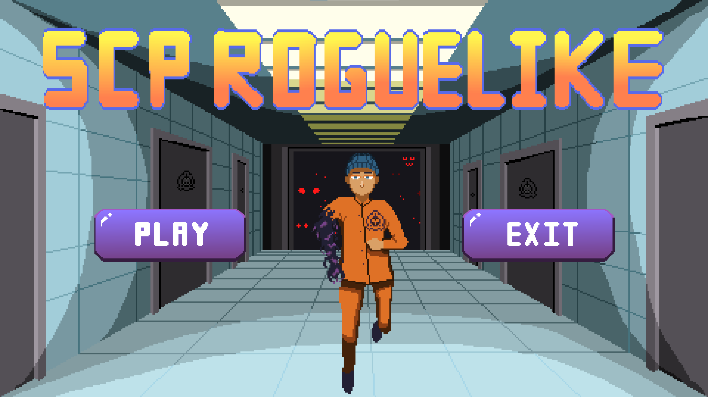

[](README.md) [](#)
# SCP Roguelike

<div align="center">
  

  <br>

  
  
  
  

  <p>
    <b>一款基於 C++ 與物件導向設計 (OOP) 的 Roguelike 遊戲。</b><br>
    獨立完成：程式架構 / 遊戲邏輯 / 像素美術
  </p>
</div>

---

## 📖 專案簡介 (Introduction)
**SCP Roguelike** 是一項 C++ OOP 課程的大型期末專案。玩家扮演一名被未知 SCP 寄生的 D 級人員，必須利用異能逃離隨機變化的收容設施。

本專案展示了**從零建構遊戲系統**的能力，不僅使用了底層圖形庫 NTUT-PTSD 進行開發，更自行實作了物理碰撞、地圖生成演算法與 AI 行為樹等核心系統。

> 🎬 **觀看完整 Demo 影片 (含音效)**: [YouTube Link](https://youtu.be/PVSwFwm1gOk)

## 🎮 遊玩畫面 (Gameplay)

| ⚔️ 戰鬥畫面 | 🛒 隨機商店系統 |
| :---: | :---: |
|  |  |

### 💀 BOSS 戰役 (Boss Battles)
針對不同 SCP 特性設計了獨特的 **狀態機 (State Machine)** 行為邏輯：

| SCP-049 (瘟疫醫生) | SCP-743 (巧克力噴泉) |
| :---: | :---: |
| **召喚與飛刀**：<br>召喚殭屍並發射飛刀攻擊玩家 | **群體攻擊**：<br>操控大量螞蟻進行包圍戰術，並透過螞蟻推動自己 |
|  |  |

---

## 🛠 技術深度解析 (Technical Deep Dive)

本專案嚴格遵循 **物件導向 (OOP)** 原則與 **現代 C++ (Smart Pointers)** 規範。

### 1. 架構設計與設計模式 (Architecture & Patterns)
* **多型與介面 (Polymorphism & Interfaces):**
    * 建立 `Actor` 基類處理通用物理與渲染。
    * 透過 `IBoss` 介面規範 Boss 行為（如 `Summon()`），並利用 `virtual functions` 實作不同敵人的 `Update()` 與 `Attack()` 邏輯。
* **單例模式 (Singleton):**
    * 應用於 `ColliderManager` 與 `LevelManager`，確保全域唯一的物理世界與關卡狀態管理，方便跨物件存取。
* **組件化思維:**
    * 將碰撞 (`BoxCollider`)、動畫 (`Animation`) 與數值 (`Health`) 封裝為獨立模組，提高程式碼重用性。

### 2. 隨機地圖生成演算法 (Procedural Generation)
位於 `LevelManager.cpp` 中的核心邏輯：
* 採用 **隨機廣度優先搜尋 (Randomized BFS / Queue-based Generation)** 演算法。
* 從起始點開始，利用 `std::queue` 與 `std::shuffle` 隨機決定房間延伸方向（上/下/左/右），生成不重複且連通的迷宮結構。
* 自動識別「死路」與「最遠距離」，智慧放置 **Boss 房** 與 **寶箱房**。

### 3. 自研物理碰撞系統 (Custom Physics)
* 不依賴現成物理引擎，自行實作 **AABB (Axis-Aligned Bounding Box)** 碰撞檢測。
* `ColliderManager` 統一管理所有碰撞體，支援 `OnTriggerEnter`, `OnTriggerStay`, `OnTriggerExit` 等回調函數 (Callbacks)，實現精準的攻擊判定與環境互動。

### 4. 記憶體管理 (Memory Management)
* 全面採用 C++ 智慧指標 (`std::shared_ptr`, `std::weak_ptr`) 取代傳統指標。
* 利用 `std::weak_ptr` 解決 `Player` 與 `Enemy` 互相參照 (Circular Dependency) 的問題，有效防止記憶體洩漏 (Memory Leak)。

### 5. 類別架構圖 (Class Hierarchy)

---

## 📂 專案結構 (Project Structure)

本專案採用標準的分離式架構，清楚區分「自研邏輯」與「外部依賴」。

```text
SCP_Roguelike/
├── include/           # [介面層] Header files (.hpp)
│   ├── Core/          # 核心引擎功能 (Actor, BoxCollider, ColliderManager)
│   ├── Enemies/       # 各類 SCP 敵人的具體定義
│   └── ...            # Player, LevelManager 等定義
│
├── src/               # [實作層] Source code (.cpp)
│   ├── LevelManager.cpp # 地圖生成與房間管理邏輯
│   ├── Tilemap.cpp      # 處理圖塊繪製與敵人生成
│   └── ...              # 遊戲核心迴圈實作
│
├── Resources/         # [美術資源] Art Assets
│   ├── Images/        # 全部由我親自繪製的 Pixel Art 素材
│   └── ...            # 音效與字型
│
├── PTSD/              # [外部框架] Practical Tools for Simple Design
│   └── ...            # 來自助教提供的底層庫 (負責視窗創建、基礎輸入)
│
└── mdImages/          # README 展示用圖片
```
## 🎨 美術與設計 (Art & Design)
* **Solo Art:** 遊戲中所有角色、怪物、地圖 Tile 與 UI 皆使用 Aseprite 親自繪製。
* **風格:** 採用 16-bit Pixel Art 風格，營造 SCP 基金會陰暗、壓抑的氛圍。

---

## 🚀 建置與執行 (Build & Run)

本專案使用 CMake 進行建置管理。

### 前置需求
* C++ Compiler (支援 C++17)
* CMake 3.10+
* Visual Studio 2019/2022 (推薦)

### 建置步驟

1. **Clone 專案**
   ```bash
   git clone [https://github.com/andyhi93/SCP_Roguelike.git](https://github.com/andyhi93/SCP_Roguelike.git)
   cd SCP_Roguelike
   ```
2. **使用 CMake 建置**

 ```bash

mkdir build && cd build
cmake ..
cmake --build .
```
3. **執行遊戲**
```
Windows: 在 build/Debug 資料夾中執行 SCP_Roguelike.exe

(或直接使用 Visual Studio 開啟專案資料夾，設為啟動專案後按 F5 執行)
```
## 📜 授權與致謝 (Credits)

* **開發者:** 謝博任 - 程式實作 / 美術繪製 / 系統架構
* **致敬與靈感 (Inspiration):**
  本專案為 OOP 課程實作練習，核心玩法機制與地圖設計概念參考自 YouTuber [Ting的作品](https://youtu.be/NOAz5rXc370?si=NM8ff2w-BiioN3Nu)。
  在此基礎上，我自行撰寫了所有 C++ 邏輯實作，並加入了部分原創的改動與延伸功能。
* **底層框架:** [PTSD (Practical Tools for Simple Design)](https://github.com/ntut-open-source-club/practical-tools-for-simple-design) - 課程助教提供
* **素材來源 (Assets):**
  * **美術:** 全數親自繪製 (Original Hand-drawn Pixel Art)。
  * **音效:** 部分網路開源素材。
  * **音樂:** 小立。
